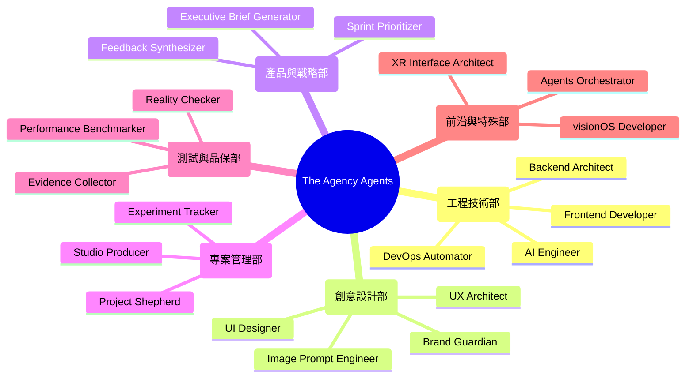
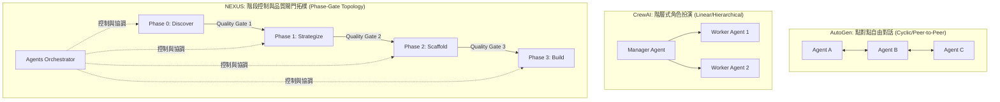

# 📚 Report 1: Multi-Agent Collaboration Framework & Architectural Taxonomy [VERIFIED]
> **文件編號**: `chu_agencyagents_architecture_taxonomy_report_20260607_v01.md`  
> **專案代號**: `L3-Zack` | **領域**: `chu` (教學與實驗) | **等級**: 專家級 (AI System Architect Level)

本報告針對開源多智能體（Multi-Agent）庫 `agency-agents` 的架構進行深度剖析，對 218 個 Agent 進行分類學（Taxonomy）梳理，並與當前主流開源多智能體框架進行對比。

---

## 1. 218 個 Agents 的 15 大分部與架構分類學 (Agent Taxonomy)

`agency-agents` 的核心特色在於其**極高密度的專業分工**。218 個 Agents 分佈於 15 個核心部門（Divisions），每個部門在專案生命週期中扮演獨特角色 [VERIFIED]：

### 1.1 核心部門角色矩陣 [VERIFIED]
1.  **Engineering (工程技術)**: 包含前端、後端、AI、行動端與 DevOps。負責實作、自動化整合與代碼重構。
2.  **Design (創意設計)**: 負責使用者體驗 (UX)、介面設計 (UI)、品牌一致性與視覺故事化。
3.  **Project Management (專案管理)**: 專注於時程協調（Shepherding）、資源追蹤與敏捷看板管理。
4.  **Testing (品保測試)**: 專司「證據收集 (Evidence Collecting)」與「真實性核對 (Reality Checking)」，是品質閘門 (Quality Gate) 的把關者。
5.  **Spatial Computing (空間計算)**: 專注於 VisionOS、XR 介面與 Metal 渲染的高階立體交互。
6.  **Specialized (特殊調度)**: 包含 `Agents Orchestrator` (總調度器)，負責系統級的 Pipeline 控制與 Handoff 分發。

### 1.2 Agent 系統提示詞設計範式 (System Prompt Design Patterns) [VERIFIED]
每個 Agent 提示詞均遵循高規的軟體工程模板，包含四大要素：
*   **Role (角色定義)**: 具體的職責描述與核心使命（e.g., "You are the Backend Architect..."）。
*   **Rules & Constraints (硬性規則)**: 如「除非特別說明，否則不要引入第三方依賴」、「僅能輸出有效代碼，不要包含客套說明」。
*   **Pipeline Input/Output (輸入/輸出標準)**: 明確定義該 Agent 接收的前導數據格式，與必須輸出的交付物。
*   **Evidence-driven Clause (證據驅動條款)**: 強制要求「不進行無事實根據的宣稱，所有優化必須附帶基準數據比對」。

---

## 2. NEXUS 協同拓樸與主流 AI 框架對比 (Collaboration Topology Comparison)

多智能體系統的「協同拓樸架構」決定了其在大規模工程中的穩定性與精準度。

### 2.1 主流多智能體框架特徵對比表 [INFERRED]

| 維度 | AutoGen (Microsoft) | CrewAI | LangGraph (LangChain) | **NEXUS Doctrine (The Agency)** |
|---|---|---|---|---|
| **拓樸結構 (Topology)** | 點對點循環 (Cyclic P2P) | 線性/樹狀階層 | 有向無環/有環圖 (DAG) | **階段門禁拓樸 (Phase-Gate Topology)** |
| **狀態管理 (State)** | 隱式 (對話歷史紀錄) | 隱式 (Task Context) | 顯式狀態圖 (State Graph) | **顯式 SSOTspec + 物理文件 Handoff** |
| **品質驗證 (Validation)** | 依賴 LLM 自我檢視 (Self-critique) | 人工審核 / 簡單檢驗 | 程式化節點斷言 | **專職 Testing 部門 + 物理證據收集器** |
| **VRAM 與 Token 損耗** | 高 (容易陷入無窮對話循環) | 中 | 中 | **低 (嚴格階段限制與 Topological Pruning)** |

### 2.2 NEXUS 拓樸的核心優勢 [VERIFIED]
NEXUS 放棄了讓 Agents 自由聊天（AutoGen 模式）的設計，因為這在大規模專案中會導致嚴重的 **「上下文漂移 (Context Drift)」** 與 **「Token 預算爆炸」**。NEXUS 通過將專案劃分為 7 個明確的 Phase，在每個 Phase 邊界設置**物理檔案交接協定 (Handoff Protocol)** 與**品質關卡 (Quality Gate)**，僅允許符合標準的輸出流向下一階段，從而在軟體工程上實現了確定性的產出質量。
