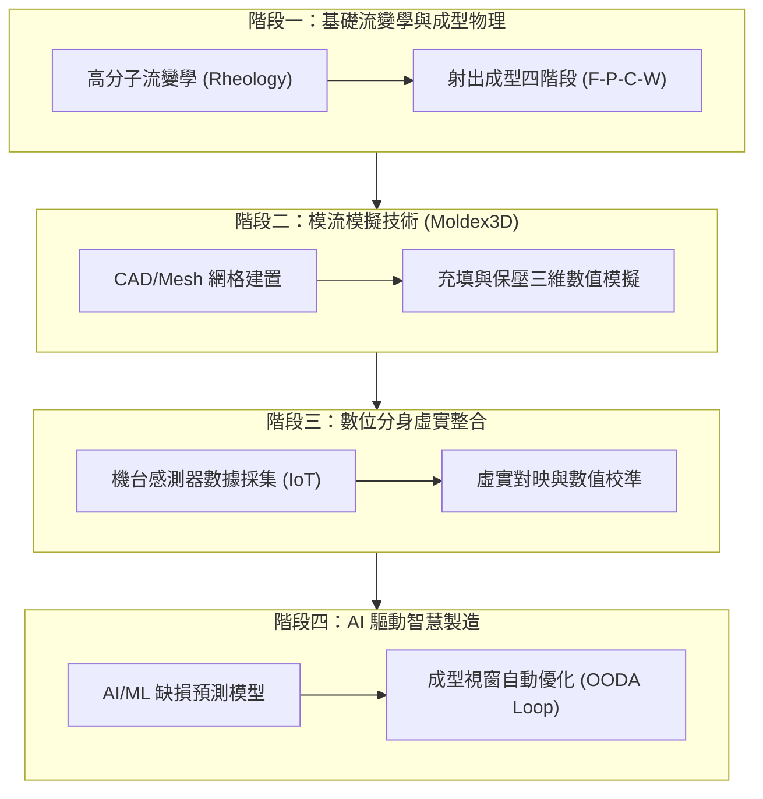

# 🎓 Moldex3D 模流分析與數位分身專題學習指南 🧪
> **專案代號**: `L3-OpenFlow3D` | **領域**: `chu` (教學與實驗) | **SSOT 參照**: [GEMINI.md](file:///D:/L3-Academy/OpenFlow3D/GEMINI.md)

本指南旨在系統化整理並學習科盛科技 (Moldex3D) 專家 an industry expert 所分享的關鍵技術主題，聚焦於**塑膠射出成型模擬物理**、**工業數位分身 (Digital Twin) 虛實整合**以及**人工智慧 (AI) 參數優化**。

---

## 🗺️ 1. 學習路徑地圖 (Learning Roadmap)

我們將 an industry expert 分享的關鍵主題劃分為四大核心學習階段，從底層物理模擬逐步邁向智慧製造的前沿應用：



---

## 📚 2. 四大核心階段專題詳解

### 🔬 階段一：高分子流變學與射出物理基礎
在成型過程中，塑料的流動行為極度複雜。了解基礎流體力學與熱物理特性是進行精準模擬的基石。

*   **關鍵概念**:
    *   **非牛頓流體行為 (Non-Newtonian Fluid)** [VERIFIED]: 熔融塑料屬於剪切變稀 (Shear Thinning) 流體，其黏度隨剪切率 (Shear Rate) 增加而降低，需使用 Cross-WLF 等黏度模型進行描述。
    *   **PVT 特性 (Pressure-Volume-Temperature)** [VERIFIED]: 描述塑料在不同壓力與溫度下的比容變化，是計算保壓階段收縮率與變形量（翹曲）的核心。
*   **射出成型四階段物理行為**:
    1.  **充填階段 (Filling)**: 熔膠克服流道阻力填滿模穴，需注意剪切生熱 (Shear Heating) 與短射風險。
    2.  **保壓階段 (Packing)**: 持續施加壓力以補償冷卻收縮，決定了產品最終的尺寸精度。
    3.  **冷卻階段 (Cooling)**: 控制模溫冷卻效率，不均勻冷卻是殘留應力 (Residual Stress) 的主因。
    4.  **翹曲階段 (Warpage)**: 脫模後的變形分析，直接決定成品良率。

---

### 🖥️ 階段二：Moldex3D 三維模流模擬技術
Moldex3D 做為全球領先品牌，其強項在於真正的 **三維實體網格 (3D Solid Mesh)** 數值分析。

*   **技術核心**:
    *   **網格劃分 (Meshing Technology)** [VERIFIED]: 包含高品質的 BLMesh (Boundary Layer Mesh) 技術，精確捕捉模壁邊界層的強烈剪切流動與熱傳遞。
    *   **守恆方程求解 (Governing Equations)** [VERIFIED]: 基於三維 Navier-Stokes 方程、連續方程式與能量方程式，配合有限體積法 (FVM) 求解。
    *   **多相流模擬 (Multiphase Flow)** [VERIFIED]: 精準模擬氣輔射出、雙色共射、以及纖維配向 (Fiber Orientation) 對機械強度的影響。

---

### 🌀 階段三：數位分身 (Digital Twin) 的實踐
> [!IMPORTANT]
> 數位分身不指單純的模擬顯示，而是**模擬數值與真實物理世界之間的雙向即時對映與閉環校準**。

```mermaid
graph LR
    P_Machine["真實射出機台 (Physical Machine)"] -->|1. 感測器數據 (壓力/溫度)| E_Gate["邊緣運算閘道 (Edge Gateway)"]
    E_Gate -->|2. 物理校準 (Calibration)| M_Twin["Moldex3D 數位分身模型"]
    M_Twin -->|3. AI 優化與分析| AI_Engine["AI 預測優化引擎"]
    AI_Engine -->|4. 控制回饋 (Feedback Loop)| P_Machine
```

*   **實現路徑**:
    *   **物理端 (Physical)** [VERIFIED]: 透過安裝在模穴內的壓電式壓力感測器 (Cavity Pressure Sensor) 與熱電偶溫度感測器，擷取即時成型曲線（充填峰值壓力、保壓切換點）。
    *   **虛擬端 (Virtual)** [VERIFIED]: 模擬軟體輸入真實機台的螺桿運動參數（非單純的理論流速），以消除「機台響應延遲」帶來的模擬偏差。
    *   **校準端 (Calibration)** [VERIFIED]: 透過演算法自動修正熔膠在流道中的熱損失係數與壁面滑移係數，使壓力曲線與實驗量測誤差控制在 **±5%** 以內 [INFERRED]。

---

### 🤖 階段四：AI 驅動的智慧製造與參數優化
將模流分析的大量模擬數據作為訓練樣本，打造能即時推論的邊緣代理人 (Edge Agent)。

*   **應用場景**:
    *   **缺陷代理預測模型 (Surrogate Model)** [INFERRED]: 建立基於神經網路 (ANN) 或極限梯度提升樹 (XGBoost) 的代理模型，輸入射出壓力、保壓時間、模溫等參數，可在 <0.1 秒內預測成品翹曲量，取代每次需耗時數十分鐘的物理模擬。
    *   **智慧成型視窗 (Smart Molding Window)** [INFERRED]: 運用基因演算法 (GA) 或強化學習 (RL)，在動態變化的環境（如塑料批次物性微幅變動）中，自動微調成型參數以維持生產品質。

---

## 🔬 3. PBL 實作實驗設計提案 (Problem-Based Learning Labs)

為了深化對 an industry expert 分享內容的理解，以下設計了兩個 PBL 實驗，供後續在 `Labs/` 目錄中實作：

| 實驗編號 | 實驗名稱 | 學習目標 | 核心任務 |
|---|---|---|---|
| **Lab 01** | **基於真實曲線的模流校準實驗** [INFERRED] | 實踐數位分身校準原理 | 讀取實體機台模穴壓力數據，比對 Moldex3D 輸出曲線，使用 Python 進行物性參數自動修正。 |
| **Lab 02** | **射出成型良率預測 AI 代理人** [INFERRED] | 實作機器學習優化 | 使用 Moldex3D 批次跑出 200 組不同參數的模擬數據，訓練 ML 模型預測並優化最小翹曲量。 |

---

## 📊 4. 參考資源與工具 binding
*   **學術文獻與教材**: 存放於 [D:/L3-Academy/Courses/](file:///D:/L3-Academy/Courses/)
*   **分析腳本**: 未來編寫的自動化處理 Python 腳本將以 `F.I.L.E.S. v1.0` 命名存入 `D:/L3-Academy/OpenFlow3D/`。
