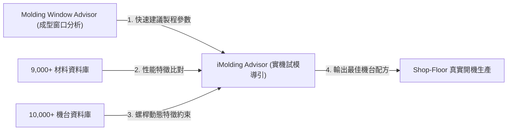

# 📚 Report 11: Moldex3D 2026 Key Upgrades & Technical Evolution Report [VERIFIED]
> **文件編號**: `igs_moldex3d_2026_key_upgrades_report_20260607_v01.md`  
> **專案代號**: `L3-OpenFlow3D` | **領域**: `igs` (工業模擬) | **等級**: 專家級 (Lead CAE Solver & Product Specialist)

本報告針對 Moldex3D 2026 新世代版本（基於自動化 Automation、設計優化 Optimization、智能化 Intelligence 主軸）進行核心技術升級評估，剖析其在**數位分身 (Digital Twin)**、**易用性 (Accessibility)** 與 **iMolding 智造生態系** 的重大工程演進。

---

## 1. 數位分身 (Digital Twin) 技術重大突破

Moldex3D 2026 將高分子材料物理與數值計算效率提升至全新維度，主要體現在四項關鍵升級：

### 1.1 雙中村結晶模型 (Dual Nakamura Crystallization Model) [VERIFIED]
*   **物理背景**: PP、PA 等結晶材料在高速冷卻（射出成型模穴壁面）下的收縮與翹曲，由結晶度動態決定。傳統模型無法精確描述結晶過程中的非等溫相變。
*   **技術升級**: Moldex3D 2026 引入 **Dual Nakamura Model**，同時考量**一次結晶 (Primary Crystallization)**、**二次結晶 (Secondary Crystallization)** 以及**壓力效應**。配合 Moldex3D 材料實驗室的真實高速冷卻量測數據，大幅精準化預測收縮凹痕與晶相引起的尺寸偏離。

### 1.2 熱流道分支出口計算 (Branch Run Out Calculation) [VERIFIED]
*   **工程痛點**: 多模穴（Multi-cavity）與複雜熱流道模擬需要在「網格精度」與「計算時長」之間權衡。
*   **技術升級**: 允許工程師使用一維線段網格 (1D Beam elements) 來分析複雜的三維分流道，而在分支出口處進行高度耦合的三維映射計算。
*   **效能效益**: 保持等同於 3D 實體流道網格的高精度，但**僅需 20% 的運算時間**（加速效果達 4 至數十倍以上），使大模穴流動平衡分析敏捷化。

### 1.3 縫合線 (Weld Line) 演算法升級 [VERIFIED]
*   **技術升級**: 大幅提升縫合線長度、空間位置與粒子追蹤 (Particle Tracking) 的一致性，呈現更真實的結合線行為。這為下游的結構強度分析（如 LS-DYNA/ABAQUS 導入各向異性強度弱化）提供了高可靠度輸入。

### 1.4 非線性纖維材料模型 (Non-linear Fiber Model) [VERIFIED]
*   **技術升級**: 玻纖強化材料在受載時呈現高度非線性力學行為。新版本支持直接將非線性纖維取向與特性數據輸出至 LS-DYNA 與 Atlas，打通了概念設計到高精度衝擊/碰撞結構驗證的 CAD-CAE-FEA 資料鏈 [VERIFIED]。

---

## 2. 全新易用性設計 (Accessibility & CAD-Mesh)

前處理（幾何修復與網格建置）佔據了分析人員 70% 的工作時間。新版針對此進行了自動化重構：

*   **Gate Location Advisor & Auto Parting Line [VERIFIED]**: 自動化判定分模方向與最佳澆口位置，大幅降低工程師人工試錯次數。
*   **等高冷卻水道建模 (Contour Cooling Channels) [VERIFIED]**: 水道設計新增連接狀態與干涉即時預覽，支援複雜等高線冷卻設計，兼顧冷卻效率與機加工可行性。
*   **多物件 Solid Mesh 前處理優化 [VERIFIED]**: 新增球體與多面體建模，強化 Split/Join/Extract Edge 靈活性，導入自動對齊與屬性自動帶入，大幅加速多物件組立件（Assembly）的網格劃分流程。

---

## 3. 虛實整合新標準：iMolding Advisor

`iMolding Advisor` 在 2026 版本中演進為一站式「資料驅動試模導引」工具，徹底取代經驗調機：

### 3.1 核心流程機制 [VERIFIED]
1.  **窗口預測**: 先由 `Molding Window Advisor` 計算出理論最優參數區間。
2.  **實機校準**: 連結 `iMolding Advisor` 導入內建的 10,000+ 射出機響應特徵，修正速度與壓力設定。
3.  **企業 Know-how 沉澱**: 所有試模的調整歷程與真實生產參數自動同步保存至 iSLM，累積為企業專屬的智能化成型數據資產。
