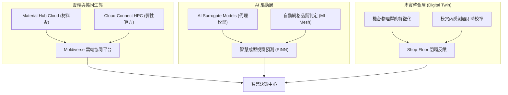

# 📚 Report 1: Moldex3D Product History & Strategic Roadmap Analysis [VERIFIED]
> **文件編號**: `igs_moldex3d_product_history_roadmap_report_20260607_v01.md`  
> **專案代號**: `L3-OpenFlow3D` | **領域**: `igs` (工業模擬) | **等級**: 專家級 (PhD / Software Architect Level)

本報告從軟體工程與產品生命週期管理 (PLM) 的視角，深度剖析科盛科技 (Moldex3D) 自 1983 年學術萌芽期至 2026 年智慧製造時代的產品歷史演進與未來戰略技術路線圖。

---

## 1. 歷史演進與產品生命週期 (Product History & Evolution)

Moldex3D 的演進軌跡代表了全球塑膠射出成型電腦輔助工程 (CAE) 行業的技術範式轉移 (Paradigm Shift)。其發展可劃分為四大核心時期：

| 時期 | 主要產品線 | 核心網格/求解器架構 | 軟體工程技術棧與架構 |
|---|---|---|---|
| **學術與奠基期 (1983 - 1995)** | 早期學術原型代碼 (NTHU-MOLD) | 2D Shell (薄殼簡化模型) | Fortran 77, 結構化程式設計, 文字驅動輸入輸出 |
| **PC Windows 時代 (1995 - 2002)** | Moldex 2D / early 3D | 2.5D Midplane, Hele-Shaw 簡化流動求解器 | C/C++, Win32 API, MFC, 單機串行計算 |
| **真實三維變革期 (2002 - 2018)** | Moldex3D R1.0 - R16 | 3D Solid Mesh (Tetra/Hex), BLM (邊界層網格) | C++11, OpenGL, MPI (平行運算), Multi-core Multi-threading |
| **智慧平台與數位分身期 (2019 - Present)** | Moldex3D Studio, iSLM, Moldiverse | 高階 3D BLM, Cloud Solver, AI 代理模型 (PINN) | Modern C++20, Qt, Web/Cloud (SaaS), RESTful API, Python SDK, Docker, AWS/Azure HPC |

### 核心演進洞察 [VERIFIED]
*   **從 2.5D 薄殼至 3D 實體求解器**: 早期工業界因算力限制，採用中面網格 (Mid-plane) 進行Hele-Shaw簡化流場分析。隨著 PC 算力爆發與 Moldex3D 3D 實體網格技術的成熟，軟體架構重構為求解完整三維 Navier-Stokes 方程，解決了厚薄差大、複雜幾何件的剪切與熱對流計算精度瓶頸。
*   **從單機模擬走向資料生命週期管理 (iSLM)**: 早期分析結果僅存在分析師本機（以龐大的 `.log` 與二進位結果檔形式）。現代架構透過 Web 化的 iSLM 進行集中式模擬數據生命週期管理，開創了從模擬 (CAE) 到模試 (Mold Trial) 再到生產 (Production) 的數據流閉環。

---

## 2. 技術路線圖與未來趨勢 (Strategic Technical Roadmap)

Moldex3D 於 2026 年及未來的核心路線圖圍繞 **「自動化、優化、智慧化」(A.O.I. Framework)** 展開，聚焦於三個核心維度：

### 2.1 彈性雲端架構 (Cloud-Native & Hybrid HPC) [VERIFIED]
*   **目標**: 降低企業自建算力叢集的基礎設施 ROI 開銷。
*   **機制**: 實作彈性調度引擎，在本地前處理完成後，可一鍵將網格模型封裝，上傳至 AWS/Azure 運算節點進行萬核並行求解，完成後僅將輕量化的結果特徵數據回傳至本地 Studio 介面進行渲染。

### 2.2 AI 與物理資訊神經網路 (PINN) 的融合 [INFERRED]
*   **目標**: 將單次物理模擬時間由「小時級」降為「毫秒級」。
*   **機制**: 結合機器學習與高分子物理方程式（如 Navier-Stokes 與張量纖維取向模型），利用歷史累積的百萬級 CAE 求解數據訓練物理限制代理模型，實現在設計階段的即時幾何/參數變更反饋。

### 2.3 Shop-floor 數位分身閉環控制 (Closed-loop Digital Twin) [VERIFIED]
*   **目標**: 解決「模擬最優設定」與「現場實際射出參數」之間的系統性落差。
*   **機制**: 機器數位分身（Machine Digital Twin）量測真實螺桿動態響應曲線並納入求解器約束；模穴壓力感測器數據即時與模擬壓力曲線對齊，自動修正塑料在不同剪切率下的黏度飄移，達成實體機台參數自動優化。
