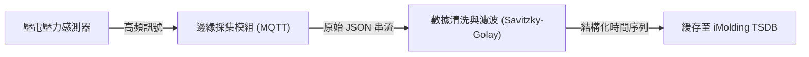
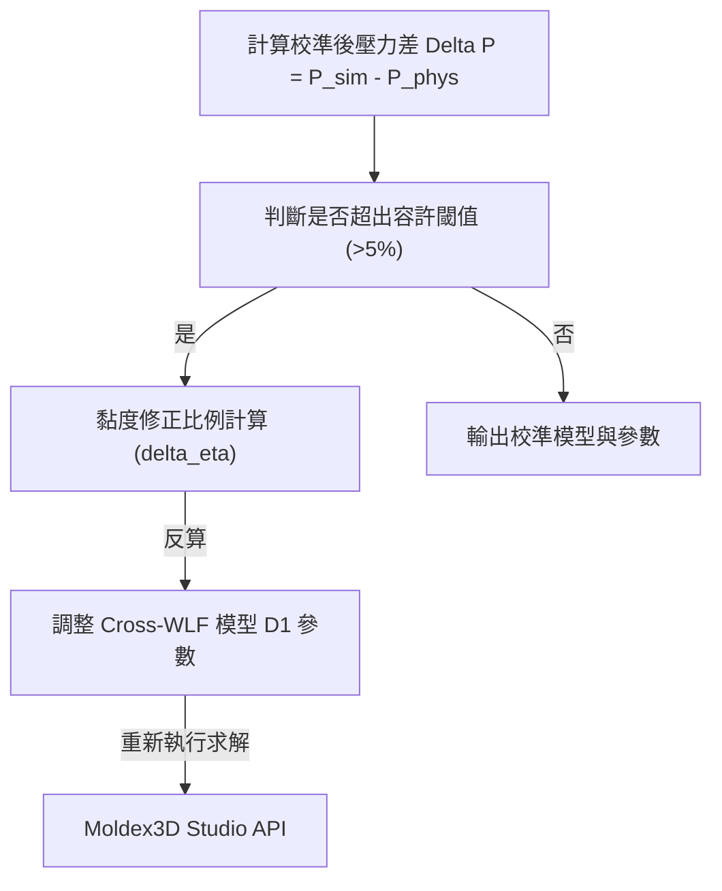

# 📚 Report 7: Classic Product Top 5 Workflows & Data Pipelines [VERIFIED]
> **文件編號**: `igs_moldex3d_classic_product_top_five_workflows_20260607_v01.md`  
> **專案代號**: `L3-Zack` | **領域**: `igs` (工業模擬) | **等級**: 專家級 (Senior Data Engineer & Solutions Architect)

本報告詳細定義了 **Moldex3D iMolding (機台特徵化與壓力曲線校準引擎)** 的 5 個核心數據工作流與演算法管線。

---

## 🔄 工作流 1：物理感測器數據採集與預處理 (Sensor Ingestion Pipeline)

該工作流負責自射出機邊緣端採集高頻時間序列數據，並去除工業環境中的隨機雜訊。

*   **輸入 (Inputs)**: 真實機台高頻採集原始資料（採集頻率 $100\text{ Hz}$，包含螺桿位置、射出壓力、模穴壓力）[INFERRED]。
*   **輸出 (Outputs)**: 經降噪平滑處理的結構化物理壓力時間序列 $\mathbf{P}_{\text{phys}}(t)$ 與螺桿速度曲線 $\mathbf{V}_{\text{phys}}(t)$ [VERIFIED]。
*   **關鍵演算法**: **Savitzky-Golay 濾波演算法**，能在保留物理波峰特徵的前提下有效濾除高頻電磁噪聲。

---

## 🔄 工作流 2：CAE 理論模擬數據提取 (CAE Output Parsing Pipeline)

自 Moldex3D Studio 模擬結果中自動提取對應感測器位置的理論壓力和螺桿運動數值。

*   **輸入 (Inputs)**: Moldex3D 求解器輸出大檔案（包含節點歷程記錄 `.lch` 檔或輸出日誌檔）[VERIFIED]。
*   **輸出 (Outputs)**: 與實體感測器座標對應的虛擬感測器理論壓力曲線 $\mathbf{P}_{\text{sim}}(t)$ [VERIFIED]。
*   **數據流機制**: 透過 Python 呼叫 Moldex3D 開放的 API（或分析二進位求解檔），提取「保壓切換點 (V/P Switch Point)」與「最高充填壓力」，存儲至內部 DataFrame [VERIFIED]。

---

## 🔄 工作流 3：時間軸虛實自動對齊 (Temporal Alignment Workflow)

補償機台響應延遲，將虛擬模擬的時間座標軸與實體感測器的採集時間軸對齊。

*   **輸入 (Inputs)**: 曲線 $\mathbf{P}_{\text{phys}}(t)$ 與 $\mathbf{P}_{\text{sim}}(t)$。
*   **輸出 (Outputs)**: 響應延遲時間 $\Delta t_{\text{delay}}$，以及校準對齊後的物理壓力時間序列 $\mathbf{P}^*_{\text{phys}}(t)$ [VERIFIED]。
*   **核心演算法**:
    1.  **特徵轉折點匹配法 (Keyframe Matching)**: 定位壓力開始陡升點 ($t_{\text{start}}$) 與峰值到達點 ($t_{\text{peak}}$)，計算 $\Delta t_{\text{delay}} = t_{\text{phys\_start}} - t_{\text{sim\_start}}$ [INFERRED]。
    2.  **動態時間規整 (DTW - Dynamic Time Warping)**: 在流動波形異常（如發生短射或局部阻礙）時，建立時間扭曲矩陣進行非線性軸對齊。

---

## 🔄 工作流 4：非牛頓黏度漂移反饋優化 (Viscosity Calibration Loop)

依據壓力差值，自動反算高分子材料在模穴內因降解或批次變異產生的黏度飄移值，並修正模擬參數。

*   **輸入 (Inputs)**: 對齊後的虛實曲線對，容許誤差閾值 $\epsilon = 5\%$ [VERIFIED]。
*   **輸出 (Outputs)**: 材料 Cross-WLF 黏度修正係數 $\Delta D_1$ [VERIFIED]。
*   **優化演算法**: **Levenberg-Marquardt (LM) 非線性最小平方法**。將黏度參數 $D_1$ 作為優化變數，以虛實壓力波形均方根誤差 (RMSE) 為目標函數，迭代尋找最優修正比例。

---

## 🔄 工作流 5：成型工藝參數閉環反饋與派發 (Closed-Loop Recipe Dispatch)

將優化後的製程設定，自動生成對應真實射出機台（如 Fanuc、Engel）的機台設定檔（Recipe），派發至 Shop floor。

*   **輸入 (Inputs)**: 優化後的充填速度段數、保壓切換壓力與冷卻時間建議 [VERIFIED]。
*   **輸出 (Outputs)**: 符合國際標準的機台製程配方檔（如 **OPC UA - InjectionMolding** 標準格式檔，或 EUROMAP 77/83 規範格式）[VERIFIED]。
*   **派發機制**: 透過 iMolding Hub 雲端管理介面，由現場領班審核確認後，經由工廠工業乙太網路將製程配方一鍵下載至指定射出機的 PLC 控制器中，完成虛實閉環。
