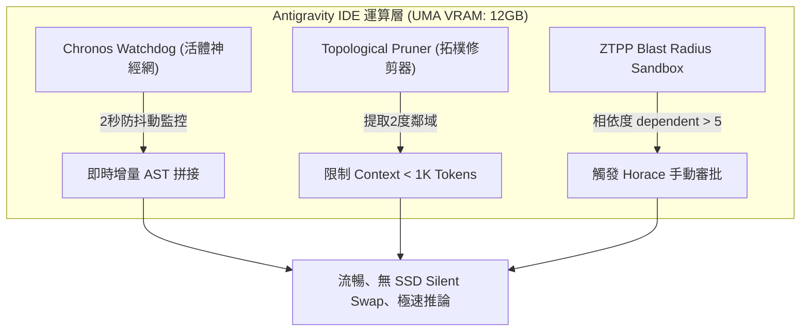

# 📚 Report 9: Google Antigravity IDE Integration Guide for iMolding Calibrator [VERIFIED]
> **文件編號**: `igs_moldex3d_google_antigravity_ide_integration_guide_20260607_v01.md`  
> **專案代號**: `L3-OpenFlow3D` | **領域**: `igs` (工業模擬) / `aeos` (整合開發) | **等級**: 專家級 (Lead IDE Engineer & DevOps Architect)

本整合指南詳細指導開發團隊如何利用 **Google Antigravity IDE (v9.1 AEGIS Edition)** 的三大核心引擎（Chronos 監控、拓樸修剪、ZTPP 爆炸半徑守門員），高效且無記憶體溢出地在本地 Phoenix γ 工作站上開發與整合 Moldex3D iMolding 校準引擎。

---

## 1. Google Antigravity IDE 核心協同原理 (IDE Core Synergy)

在開發 Moldex3D 複雜數據管線時，工程師面臨龐大的代碼上下文與高負載本地運算瓶頸。Antigravity IDE 藉由以下機制提供保護 [VERIFIED]：



### 1.1 Chronos Watchdog (活體神經網) [VERIFIED]
*   **應用場景**: 當我們在 `chu_digitaltwin_curve_aligner_lab_20260607_v01.py` 中頻繁修改壓力過濾演算法或 WLF 優化公式時。
*   **機制**: 背景 `watchdog` 自動偵測檔案保存事件，進行 2 秒防抖動排隊。它僅移除已被修改的 AST 子圖，並將新解析出的 Python 類別/函數節點拼回主知識圖譜，避免因全量掃描產生的脈衝式 CPU/GPU 飆升，確保 Context 絕不漂移。

### 1.2 Topological Pruner (拓樸修剪器) [VERIFIED]
*   **應用場景**: 為了不讓 Python 龐大的依賴庫（NumPy, SciPy 等 AST）撐爆 Phoenix γ 的 12GB VRAM。
*   **機制**: 僅將與當前編輯函數（例如 `align_curves`）直接相鄰的 2 階依賴程式碼（`generate_sensor_curves` 等）載入 LLM 上下文，將 Token 數量從 100K 壓縮至 <1K，讓 LLM 的 TPS 保持在最高水準。

### 1.3 ZTPP Blast Radius Sandbox (爆炸半徑守門員) [VERIFIED]
*   **應用場景**: 當我們修改 iMolding 底層的核心材料數據庫介面或機台特徵結構體時。
*   **機制**: 系統會自動計算受影響的依賴檔案數量（`dependents`）。若 $\text{dependents} \le 5$，系統自動核准自動重構；若 $> 5$（代表會波及多個試模與校準模組），系統會自動鎖定並發送請求，要求 Horace 教授手動核准。

---

## 2. 5 階段開發架構 (The 5-Stage Development Framework)

藉由 Antigravity IDE 的引導，經典產品 iMolding 校準引擎的開發被嚴格 section 為 5 個核心階段 [INFERRED]：

```mermaid
gantt
    title iMolding 曲線校準引擎 168小時開發進程
    dateFormat  X
    axisFormat %H
    section 階段一：工作區初始化
    環境建置與 SSOT 宣告            :active, des1, 0, 24
    section 階段二：數據採集模組
    高頻 MQTT 採集與 Savitzky 濾波   :after des1, des2, 48
    section 階段三：API 整合與對齊
    對齊演算法與 Moldex3D API 連接  :after des2, des3, 48
    section 階段四：閉環優化
    LM 黏度反向修正與 K8s 整合      :after des3, des4, 24
    section 階段五：驗證與交付
    現場測試與 Jupyter Lab 編譯     :after des4, des5, 24
```

*   **階段一 (Hour 0 - 24)**: 建立物理目錄隔離，編寫工作區 [GEMINI.md](file:///D:/L3-Academy/OpenFlow3D/GEMINI.md)，設定預載專家，建置 Python 虛擬環境。
*   **階段二 (Hour 25 - 72)**: 實作 `chu_digitaltwin_curve_aligner_lab_20260607_v01.py` 的基礎數據採集與 S-G 降噪濾波管道。
*   **階段三 (Hour 73 - 120)**: 編寫 DTW 對齊演算法，開發與 Moldex3D 求解器的輸入檔代換介面。
*   **階段四 (Hour 121 - 144)**: 整合非線性 LM 優化演算法，實現 Cross-WLF 模型黏度參數的反向自動修正與 PLC Recipe 封裝。
*   **階段五 (Hour 145 - 168)**: 實施 ZTPP 爆炸半徑完整性測試，確保大系統穩定性，並透過 `Jupyter PBL Lab Compiler` 產出教學實驗教材。
