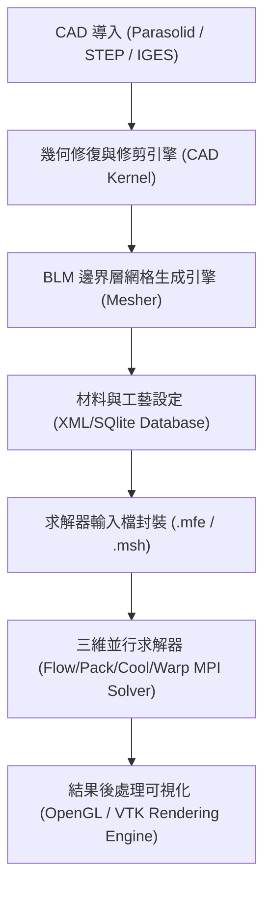
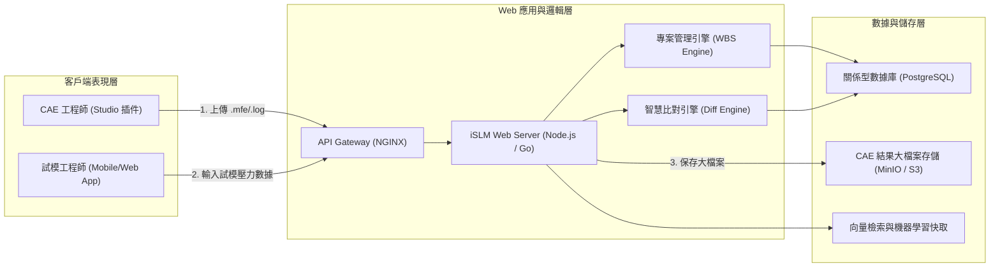
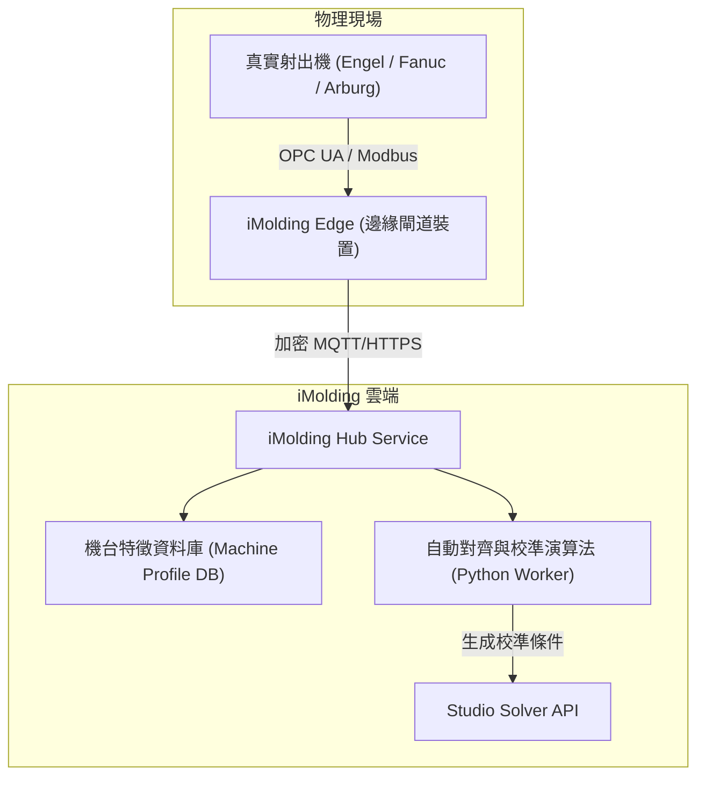

# 📚 Report 5: Moldex3D Top 3 Products Architectural Review [VERIFIED]
> **文件編號**: `igs_moldex3d_top_three_products_review_20260607_v01.md`  
> **專案代號**: `L3-Zack` | **領域**: `igs` (工業模擬) | **等級**: 系統架構師級 (Lead System Architect)

本報告針對 Moldex3D 生態圈中最重要的三款核心產品（Studio、iSLM、iMolding Hub）進行軟體系統架構、元件依賴性與數據流設計的深度剖析。

---

## 🛠️ 產品一：Moldex3D Studio (CAE 整合分析桌面端)

`Studio` 是 Moldex3D 的主力旗艦桌面產品，整合了幾何前處理、網格劃分、求解設定與後處理結果可視化。

### 1. 軟體架構元件與技術棧 [VERIFIED]
*   **前端 GUI**: 基於 **Qt (C++)** 與 QML 實現跨平台（主力為 Windows）的高性能交互介面。
*   **3D 渲染核心**: 基於客製化 **OpenGL / VTK (Visualization Toolkit)** 的高並行網格與流線渲染引擎，支援百萬級網格的流暢縮放與剖面切割。
*   **網格劃分器 (Mesher)**: 底層 C++ 專利網格引擎，包含高縱橫比 BLM 網格生成演算法與自動非匹配網格 (Non-matching Mesh) 連接技術。

---

## 🌐 產品二：Moldex3D iSLM (智慧模擬生命週期管理系統)

`iSLM` 是一套專為塑膠工程設計的 **SaaS / Web 雲端協同數據管理平台**，打通了模擬工程師與現場試模人員之間的資料鴻溝。

### 1. 軟體架構元件與技術棧 [VERIFIED]
*   **表現層 (Frontend)**: 基於 **React** 或 **Vue** 實現的響應式 Web 儀表板，支援在瀏覽器中直接進行輕量化 3D 模具結果查看（WebGL）。
*   **微服務後端**: 採用 Node.js / Go 開發，負責處理大檔案分片上傳、項目工作分解結構 (WBS) 工作流調度與權限管控。
*   **資料儲存**: 使用 PostgreSQL 記錄非文件數據（材料 ID、試模參數、人員）；大檔案（網格與模擬解）則直接儲存至 Amazon S3 或本地私有雲儲存 (MinIO)。

---

## 🌀 產品三：Moldex3D iMolding Hub (數位分身虛實整合平台)

`iMolding Hub` 是實現實體射出機台數據與模擬環境「雙向同步與校準」的邊緣運算與雲端分析平台。

### 1. 軟體架構元件與技術棧 [VERIFIED]
*   **邊緣採集端 (iMolding Edge)**: 部署於現場的 Linux 工控機，以 Python/Go 運行邊緣數據採集模組，支持 OPC UA、Modbus 等工業協定，每 10 毫秒採集一次螺桿位置與模穴壓力 [INFERRED]。
*   **雲端微服務 (iMolding Hub)**: 構建於 Kubernetes 環境，提供 Machine Characterization (機台特性化) 的雲端識別演算法，將實體機台的物理摩擦、油路壓縮特性提取為特徵檔。
*   **演算法引擎**: Python 科學計算棧 (NumPy, SciPy, Pandas)，負責對採集到的動態壓力曲線進行平滑、特徵點定位與物理補償值估算 [INFERRED]。
